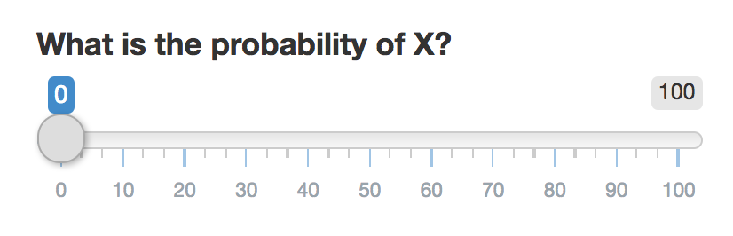
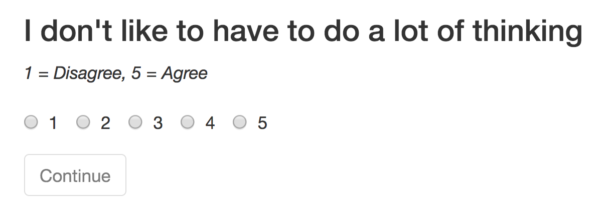

--- &twocol
## I want to program a study, what software can I use?


***=left
- Lab-based study: Use Psychopy
- Online study (???)
    - Survey software? HTML / JavaScript?

***=right


--- .class #id 
## Comparing online software

| Software| Time to Learn|Cost|Customizability | Best Suited for|
|------:|----:|:-----|:----|:----|:----|
|     UniPark / Qualtrics| Medium |   ?|Low | Questionnaires     |
|     Inquisit|    Medium / Low|? | Medium (?) | Questionnaires, Simple stimuli     |
|     Custom HTML / JavaScript|   High|Free | Very High | Complex studies     |
|     Shiny|    Medium / High|Free* | High | Complex, statistical stimuli     |

--- .class #id 
## What is Shiny?

- Shiny is a web application framework for R.
- From the website: Turn your analyses into interactive web applications. No HTML, CSS, or JavaScript knowledge required.
- Shiny applications are called "Apps" (aka, experiment)


--- &twocol
## What is Shiny?

***=left

- Shiny was developed to let people easily make cool, interactive websites with data, not to create experiments.
- However, just like psychologists have appropriated the Amazon mTurk for participant recruitment, I think we can also appropriate Shiny to create online experiments.
- Over the past few months, I, along with Markus Steiner and Kevin Trutmann (also Janine Hoffart) have been 'hacking' Shiny to run experiments.

***=right


--- .class #id 
## Programming a Shiny "App"

- Combination of standard R code, and special Shiny R functions that create and manage interactive elements.


```r
sliderInput(inputId = "prob.est", 
            label = "What is the probability of X?", 
            min = 0, 
            max = 100)
```

Becomes




--- .class #id 
## Programming a Shiny "App"

- Combination of standard R code, and special Shiny R functions that create and manage interactive elements.


```r
h3("I don't have to do a lot of thinking")
radioButtons(inputId = "REI_q1", 
             label = "1 = Disagree, 5 = Agree",
             choices = list(1:5))
```

Becomes



--- .class #id 
## Programming a Shiny "App"

- Once a participant completes an input, the result is stored as an r object you can then use any way you'd like


```r
# Store result in prob.est
sliderInput(inputId = "prob.est", 
            label = "What is the probability of X?", 
            min = 0, 
            max = 100)

# Use prob.est in other code

true.value <- 33
error <- abs(input$prob.est - true.value)

h3("Your estimate was off by ", error)
```


--- .class #id 
## Programming a Shiny "App"

- Randomizing stimuli order is no problem.
- You can write 'pseudo-loops' to sequentially display questions or other stimuli automatically and then store sequential responses.


```r
rei.survey <- list(
  "text" = c("I don't like to have to do a lot of thinking",
             "I try to avoid situations that require thinking in depth about something",
             "I prefer to do something that challenges my thinking abilities rather than something that requires little thought",
             "I prefer complex to simple problems",
             "Thinking hard and for a long time about something gives me little satisfaction",
             "I trust my initial feelings about people",
             "I believe in trusting my hunches",
             "My initial impressions of people are almost always right",
             "When it comes to trusting people, I can usually rely on my 'gut feelings'",
             "I can usually feel when a person is right or wrong even if I can't explain how I know"))
```


--- .class #id 
## Example: A simple survey


### Go to ShinySurvey

--- .class #id 
## Example: The BART

### Go to ShinyBART

--- .class #id 
## Example: A Bandit Task

[https://econpsychbasel.shinyapps.io/ShinyBandit/](https://econpsychbasel.shinyapps.io/ShinyBandit/)

--- .class #id 
## Example: An Advanced bandit task

[https://econpsychbasel.shinyapps.io/BanditGame4/](https://econpsychbasel.shinyapps.io/BanditGame4/)

--- .class #id 
## Notes

- Data can automatically be uploaded to Dropbox or emailed (I'm pretty sure).
- Group experiments are possible!

--- .class #id 
## How to run a ShinyApp

- In order for participants to use your App, it has to be hosted on a Shiny Server.
- You can run up to 5 apps for free at RStudio.
- 3 options for advanced hosting: RStudio Pro (\$900 / year), Amazon Web Services, or in-house ($4,500 / year).
- If there is enough interest, our IT will set up an in-house server

--- .class #id 
## Shiny Pros and Cons

### Pros
- You can integrate all of your data management using R code within the experiment.
    - Great for dynamic experiments where stimuli depend on responses.
- Data can be easily exported in exactly the format you want to Dropbox or via email.

### Cons
- Simple things you get for free in Survey software require extra code.
    - Required responses, checking for invalid responses.
- Crashing is, unfortunately, somewhat common.
    - No more than 20 simultaneous users.
- Response time measures are almost certainly not very precise
    - >500ms is probably ok, <500ms is probably not

--- .class #id
## What's next?

- We are currently programming and documenting standard psychology experiments in Shiny and distributing them at [http://www.github.com/ndphillips/ShinyPsych](http://www.github.com/ndphillips/ShinyPsych).

- Check out the code, play around, let us know what works and what doesn't, and contribute!
